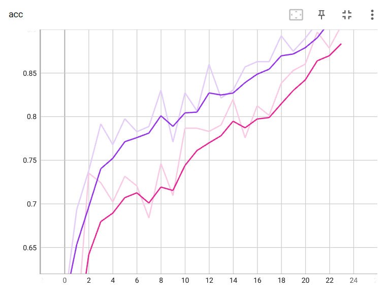
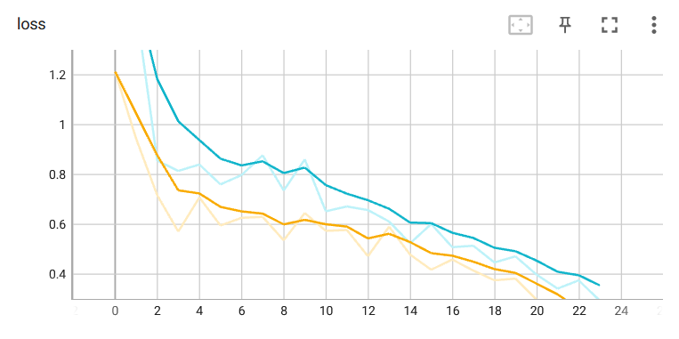
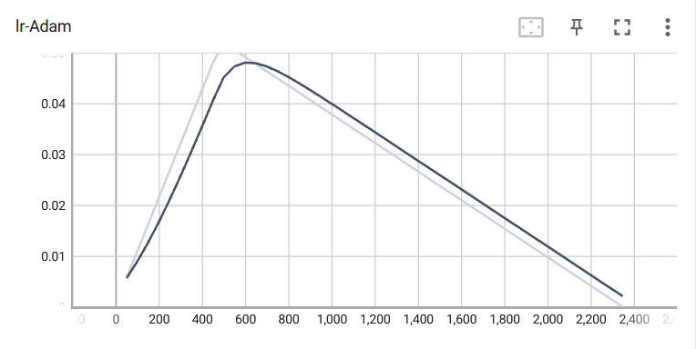
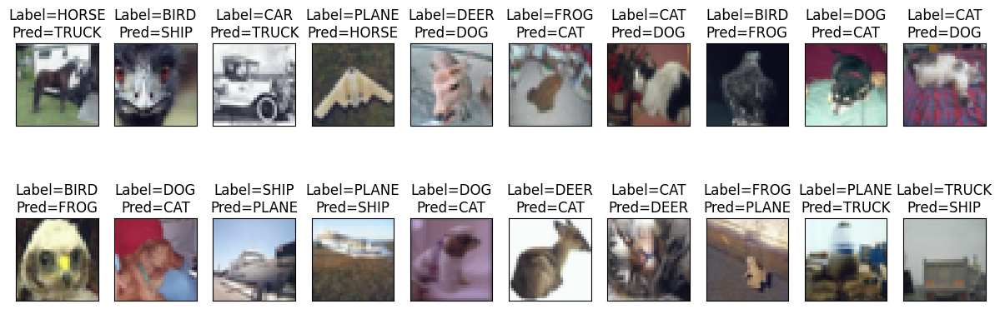

# S12-Assignment-Solution

This repository contains an implementation of a CustomResNet model for the CIFAR10 dataset using PyTorch Lightning. The model is trained using the One Cycle Policy with data augmentation and transformation techniques.

## Files Description

The repository consists of the following files:

### 1. `ERA-S12.ipynb`

This Jupyter Notebook file contains the main code and instructions to run the training process for the customResNet model on the CIFAR10 dataset using PyTorch Lightning. It imports the necessary modules from the other files and runs the training process for a specified number of epochs and displays the validation accuracy.

### 2. `dataloader.py`

The `dataloader.py` file contains the code to create the data loader for the CIFAR10 dataset. It handles loading the dataset, applying transformations, and creating batches of data for training and validation.

### 3. `model.py`

The `model.py` file defines the CustomResNet architecture for CIFAR10 using PyTorch Lightning's `LightningModule`. It includes the `PrepLayer`, `Layer1`, `Layer2`, `Layer3`, and the fully connected (`FC`) layer, with appropriate activation functions and batch normalization.

### 4. `trainer.py`

The `trainer.py` file contains the `LitCifar10` class, which serves as the PyTorch Lightning `LightningModule` responsible for defining the training and validation logic, as well as data handling for the CIFAR10 dataset.

#### - LitCifar10 class

The `LitCifar10` class extends `LightningModule` and contains the following key components:

#### - Initialization

- `__init__(self, data_dir="./data", learning_rate=0.03, weight_decay=1e-4, end_lr=10, batch_size=256)`: The constructor method initializes the parameters required for training the model. It sets the data directory, learning rate, weight decay, end learning rate for the One Cycle Policy, and batch size.

#### - Forward Pass

- `forward(self, x)`: This method performs the forward pass of the model by calling the `self.model(x)`.

#### - Training Step

- `training_step(self, batch, batch_idx)`: This method defines the training step for the model. It computes the forward pass, calculates the CrossEntropyLoss, and logs the training loss, accuracy, and learning rate for each epoch.

#### - Validation Step

- `validation_step(self, batch, batch_idx)`: This method defines the validation step for the model. It computes the forward pass, calculates the CrossEntropyLoss, and logs the validation loss and accuracy for each epoch.

#### - Test Step

- `test_step(self, batch, batch_idx)`: This method defines the test step for the model. It computes the forward pass, calculates the CrossEntropyLoss, and logs the test loss and accuracy for each test batch. It also records the incorrect predictions for further analysis.

#### - Test End

- `on_test_end(self)`: This method is called at the end of the test run. It plots and displays some of the incorrect predictions made by the model during the testing phase.

#### - Optimizer and Scheduler Configuration

- `configure_optimizers(self)`: This method sets up the optimizer and learning rate scheduler for training. It utilizes the Adam optimizer with the learning rate determined using a learning rate finder and a One Cycle Learning Rate Scheduler.

#### - Data Related Hooks

- `setup(self, stage=None)`: This method sets up the datasets for training, validation, and testing based on the provided stage. It initializes the train, validation, and test datasets using the specified transformations.

#### - Data Loaders

- `train_dataloader(self)`: This method returns the data loader for the training dataset.
- `val_dataloader(self)`: This method returns the data loader for the validation dataset.
- `test_dataloader(self)`: This method returns the data loader for the test dataset.

### 5. `utils.py`

The `utils.py` file contains utility functions used in the training process, such as functions to get the learning rate, visualize images, get the device, print model summary, and other helper functions.

### 6. `transforms.py`

The `transforms.py` file includes data augmentation and transformation functions used during training. It contains the `RandomCrop`, `FlipLR`, and `CutOut` transformations as specified in the assignment.

## Architecture

The Custom ResNet architecture for CIFAR10 is structured as follows:

==========================================================================================

```
==========================================================================================
Layer (type:depth-idx)                   Output Shape              Param #
==========================================================================================
CustomResNet                             [1, 10]                   --
├─Sequential: 1-1                        [1, 64, 32, 32]           --
│    └─Conv2d: 2-1                       [1, 64, 32, 32]           1,728
│    └─ReLU: 2-2                         [1, 64, 32, 32]           --
│    └─BatchNorm2d: 2-3                  [1, 64, 32, 32]           128
│    └─Dropout: 2-4                      [1, 64, 32, 32]           --
├─ResNetBlock: 1-2                       [1, 128, 16, 16]          --
│    └─Sequential: 2-5                   [1, 128, 16, 16]          --
│    │    └─Conv2d: 3-1                  [1, 128, 32, 32]          73,728
│    │    └─MaxPool2d: 3-2               [1, 128, 16, 16]          --
│    │    └─ReLU: 3-3                    [1, 128, 16, 16]          --
│    │    └─BatchNorm2d: 3-4             [1, 128, 16, 16]          256
│    │    └─Dropout: 3-5                 [1, 128, 16, 16]          --
│    └─Sequential: 2-6                   [1, 128, 16, 16]          --
│    │    └─Conv2d: 3-6                  [1, 128, 16, 16]          147,456
│    │    └─ReLU: 3-7                    [1, 128, 16, 16]          --
│    │    └─BatchNorm2d: 3-8             [1, 128, 16, 16]          256
│    │    └─Dropout: 3-9                 [1, 128, 16, 16]          --
│    │    └─Conv2d: 3-10                 [1, 128, 16, 16]          147,456
│    │    └─ReLU: 3-11                   [1, 128, 16, 16]          --
│    │    └─BatchNorm2d: 3-12            [1, 128, 16, 16]          256
├─Sequential: 1-3                        [1, 256, 8, 8]            --
│    └─Conv2d: 2-7                       [1, 256, 16, 16]          294,912
│    └─MaxPool2d: 2-8                    [1, 256, 8, 8]            --
│    └─ReLU: 2-9                         [1, 256, 8, 8]            --
│    └─BatchNorm2d: 2-10                 [1, 256, 8, 8]            512
│    └─Dropout: 2-11                     [1, 256, 8, 8]            --
├─ResNetBlock: 1-4                       [1, 512, 4, 4]            --
│    └─Sequential: 2-12                  [1, 512, 4, 4]            --
│    │    └─Conv2d: 3-13                 [1, 512, 8, 8]            1,179,648
│    │    └─MaxPool2d: 3-14              [1, 512, 4, 4]            --
│    │    └─ReLU: 3-15                   [1, 512, 4, 4]            --
│    │    └─BatchNorm2d: 3-16            [1, 512, 4, 4]            1,024
│    │    └─Dropout: 3-17                [1, 512, 4, 4]            --
│    └─Sequential: 2-13                  [1, 512, 4, 4]            --
│    │    └─Conv2d: 3-18                 [1, 512, 4, 4]            2,359,296
│    │    └─ReLU: 3-19                   [1, 512, 4, 4]            --
│    │    └─BatchNorm2d: 3-20            [1, 512, 4, 4]            1,024
│    │    └─Dropout: 3-21                [1, 512, 4, 4]            --
│    │    └─Conv2d: 3-22                 [1, 512, 4, 4]            2,359,296
│    │    └─ReLU: 3-23                   [1, 512, 4, 4]            --
│    │    └─BatchNorm2d: 3-24            [1, 512, 4, 4]            1,024
├─MaxPool2d: 1-5                         [1, 512, 1, 1]            --
├─Linear: 1-6                            [1, 10]                   5,130
==========================================================================================
Total params: 6,573,130
Trainable params: 6,573,130
Non-trainable params: 0
Total mult-adds (M): 379.27
==========================================================================================
Input size (MB): 0.01
Forward/backward pass size (MB): 4.65
Params size (MB): 26.29
Estimated Total Size (MB): 30.96
==========================================================================================
```


## One Cycle Policy

The training process uses the One Cycle Policy with the following configurations:

- Total Epochs: 24
- Max Learning Rate (LR) at Epoch: 5
- LRMIN: To be determined during training
- LRMAX: To be determined during training
- No Annihilation during the learning rate schedule

## Data Transformations

The dataset is transformed using the following steps:

- RandomCrop of size 32x32 (after padding of 4)
- FlipLR (Flip Left-Right)
- CutOut with a mask size of 8x8

## Training Configuration

- Batch size: 512
- Optimizer: Adam
- Loss function: CrossEntropyLoss


## Training Logs

```
Epoch 0/23 ━━━━━━━━━━━━━━━━━━━━━━━━━━━━━━━━━━ 98/98 0:00:19 • 0:00:00 4.97it/s v_num: 1 train_loss: 1.322          
                                                                               train_acc: 0.551 lr: 0.011          


Epoch 1/23 ━━━━━━━━━━━━━━━━━━━━━━━━━━━━━━━━━━ 98/98 0:00:20 • 0:00:00 4.83it/s v_num: 1 train_loss: 0.885          
                                                                               train_acc: 0.682 lr: 0.022 val_loss:
                                                                               1.211 val_acc: 0.507                


Epoch 2/23 ━━━━━━━━━━━━━━━━━━━━━━━━━━━━━━━━━━ 98/98 0:00:19 • 0:00:00 4.95it/s v_num: 1 train_loss: 0.733          
                                                                               train_acc: 0.774 lr: 0.033 val_loss:
                                                                               0.913 val_acc: 0.636                


Epoch 3/23 ━━━━━━━━━━━━━━━━━━━━━━━━━━━━━━━━━━ 98/98 0:00:20 • 0:00:00 4.80it/s v_num: 1 train_loss: 0.663          
                                                                               train_acc: 0.78 lr: 0.044 val_loss: 
                                                                               0.782 val_acc: 0.72                 


Epoch 4/23 ━━━━━━━━━━━━━━━━━━━━━━━━━━━━━━━━━━ 98/98 0:00:20 • 0:00:00 4.88it/s v_num: 1 train_loss: 0.727          
                                                                               train_acc: 0.768 lr: 0.055 val_loss:
                                                                               0.999 val_acc: 0.737                


Epoch 5/23 ━━━━━━━━━━━━━━━━━━━━━━━━━━━━━━━━━━ 98/98 0:00:20 • 0:00:00 4.86it/s v_num: 1 train_loss: 0.719          
                                                                               train_acc: 0.747 lr: 0.052 val_loss:
                                                                               0.914 val_acc: 0.744                


Epoch 6/23 ━━━━━━━━━━━━━━━━━━━━━━━━━━━━━━━━━━ 98/98 0:00:20 • 0:00:00 4.74it/s v_num: 1 train_loss: 0.569          
                                                                               train_acc: 0.81 lr: 0.05 val_loss:  
                                                                               0.739 val_acc: 0.756                


Epoch 7/23 ━━━━━━━━━━━━━━━━━━━━━━━━━━━━━━━━━━ 98/98 0:00:20 • 0:00:00 4.78it/s v_num: 1 train_loss: 0.587          
                                                                               train_acc: 0.801 lr: 0.047 val_loss:
                                                                               0.94 val_acc: 0.752                 


Epoch 8/23 ━━━━━━━━━━━━━━━━━━━━━━━━━━━━━━━━━━ 98/98 0:00:20 • 0:00:00 4.79it/s v_num: 1 train_loss: 0.615          
                                                                               train_acc: 0.786 lr: 0.044 val_loss:
                                                                               0.646 val_acc: 0.778                


Epoch 9/23 ━━━━━━━━━━━━━━━━━━━━━━━━━━━━━━━━━━ 98/98 0:00:20 • 0:00:00 4.73it/s v_num: 1 train_loss: 0.596          
                                                                               train_acc: 0.81 lr: 0.041 val_loss: 
                                                                               0.645 val_acc: 0.782                


Epoch 10/23 ━━━━━━━━━━━━━━━━━━━━━━━━━━━━━━━━━━ 98/98 0:00:20 • 0:00:00 4.80it/s v_num: 1 train_loss: 0.529         
                                                                                train_acc: 0.824 lr: 0.038         
                                                                                val_loss: 0.624 val_acc: 0.788     


Epoch 11/23 ━━━━━━━━━━━━━━━━━━━━━━━━━━━━━━━━━━ 98/98 0:00:20 • 0:00:00 4.77it/s v_num: 1 train_loss: 0.613         
                                                                                train_acc: 0.81 lr: 0.035 val_loss:
                                                                                0.644 val_acc: 0.79                


Epoch 12/23 ━━━━━━━━━━━━━━━━━━━━━━━━━━━━━━━━━━ 98/98 0:00:20 • 0:00:00 4.71it/s v_num: 1 train_loss: 0.576         
                                                                                train_acc: 0.818 lr: 0.032         
                                                                                val_loss: 0.707 val_acc: 0.795     


Epoch 13/23 ━━━━━━━━━━━━━━━━━━━━━━━━━━━━━━━━━━ 98/98 0:00:20 • 0:00:00 4.77it/s v_num: 1 train_loss: 0.474         
                                                                                train_acc: 0.836 lr: 0.029         
                                                                                val_loss: 0.67 val_acc: 0.799      


Epoch 14/23 ━━━━━━━━━━━━━━━━━━━━━━━━━━━━━━━━━━ 98/98 0:00:21 • 0:00:00 4.72it/s v_num: 1 train_loss: 0.521         
                                                                                train_acc: 0.807 lr: 0.026         
                                                                                val_loss: 0.548 val_acc: 0.805     


Epoch 15/23 ━━━━━━━━━━━━━━━━━━━━━━━━━━━━━━━━━━ 98/98 0:00:20 • 0:00:00 4.76it/s v_num: 1 train_loss: 0.474         
                                                                                train_acc: 0.824 lr: 0.023         
                                                                                val_loss: 0.573 val_acc: 0.809     


Epoch 16/23 ━━━━━━━━━━━━━━━━━━━━━━━━━━━━━━━━━━ 98/98 0:00:20 • 0:00:00 4.76it/s v_num: 1 train_loss: 0.464         
                                                                                train_acc: 0.839 lr: 0.02 val_loss:
                                                                                0.614 val_acc: 0.812               


Epoch 17/23 ━━━━━━━━━━━━━━━━━━━━━━━━━━━━━━━━━━ 98/98 0:00:21 • 0:00:00 4.68it/s v_num: 1 train_loss: 0.412         
                                                                                train_acc: 0.863 lr: 0.017         
                                                                                val_loss: 0.645 val_acc: 0.819     


Epoch 18/23 ━━━━━━━━━━━━━━━━━━━━━━━━━━━━━━━━━━ 98/98 0:00:20 • 0:00:00 4.76it/s v_num: 1 train_loss: 0.347         
                                                                                train_acc: 0.899 lr: 0.015         
                                                                                val_loss: 0.47 val_acc: 0.836      


Epoch 19/23 ━━━━━━━━━━━━━━━━━━━━━━━━━━━━━━━━━━ 98/98 0:00:20 • 0:00:00 4.76it/s v_num: 1 train_loss: 0.422         
                                                                                train_acc: 0.869 lr: 0.012         
                                                                                val_loss: 0.436 val_acc: 0.844     


Epoch 20/23 ━━━━━━━━━━━━━━━━━━━━━━━━━━━━━━━━━━ 98/98 0:00:21 • 0:00:00 4.66it/s v_num: 1 train_loss: 0.284         
                                                                                train_acc: 0.905 lr: 0.009         
                                                                                val_loss: 0.45 val_acc: 0.853      


Epoch 21/23 ━━━━━━━━━━━━━━━━━━━━━━━━━━━━━━━━━━ 98/98 0:00:21 • 0:00:00 4.70it/s v_num: 1 train_loss: 0.238         
                                                                                train_acc: 0.935 lr: 0.006         
                                                                                val_loss: 0.397 val_acc: 0.869     


Epoch 22/23 ━━━━━━━━━━━━━━━━━━━━━━━━━━━━━━━━━━ 98/98 0:00:21 • 0:00:00 4.71it/s v_num: 1 train_loss: 0.197         
                                                                                train_acc: 0.938 lr: 0.003         
                                                                                val_loss: 0.344 val_acc: 0.883     


Epoch 23/23 ━━━━━━━━━━━━━━━━━━━━━━━━━━━━━━━━━━ 98/98 0:00:21 • 0:00:00 4.69it/s v_num: 1 train_loss: 0.139         
                                                                                train_acc: 0.961 lr: 0.0 val_loss: 
                                                                                0.308 val_acc: 0.903               
INFO:pytorch_lightning.utilities.rank_zero:`Trainer.fit` stopped: `max_epochs=24` reached.
```


## Graphs

#### Accuracy




#### Loss




#### Learning Rate




## 20 Misclassified Images

